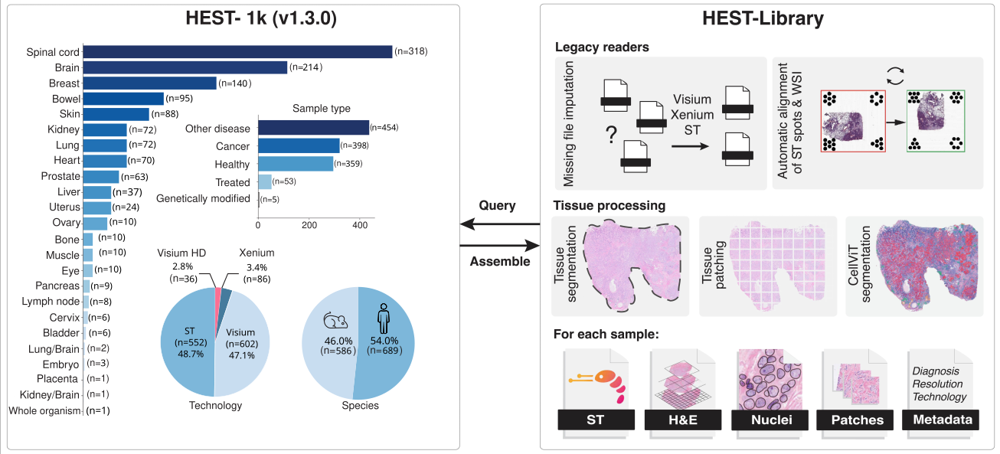

# HEST-Library: Bringing Spatial Transcriptomics and Histopathology together
## Designed for querying and assembling HEST-1k dataset 

\[ [arXiv](https://arxiv.org/abs/2406.16192) | [Data](https://huggingface.co/datasets/MahmoodLab/hest) | [Documentation](https://hest.readthedocs.io/en/latest/) | [Tutorials](https://github.com/mahmoodlab/HEST/tree/main/tutorials) | [Cite](https://github.com/mahmoodlab/hest?tab=readme-ov-file#citation) \]
<!-- [ArXiv (stay tuned)]() | [Interactive Demo](http://clam.mahmoodlab.org) | [Cite](#reference) -->

Welcome to the official GitHub repository of the HEST-Library introduced in *"HEST-1k: A Dataset for Spatial Transcriptomics and Histology Image Analysis", NeurIPS Spotlight, 2024*. This project was developed by the [Mahmood Lab](https://faisal.ai/) at Harvard Medical School and Brigham and Women's Hospital. 



<br/>

### What does this repository provide?
- **HEST-1k:** Free access to <b>HEST-1K</b>, a dataset of 1,276 paired Spatial Transcriptomics samples with HE-stained whole-slide images 
- **HEST-Library:** A series of helpers to assemble new ST samples (ST, Visium, Visium HD, Xenium) and work with HEST-1k (ST analysis, batch effect viz and correction, etc.)
- **HEST-Benchmark:** A new benchmark to assess the predictive performance of foundation models for histology in predicting gene expression from morphology 

HEST-1k, HEST-Library, and HEST-Benchmark are released under the Attribution-NonCommercial-ShareAlike 4.0 International license. 

<br/>

## Updates

- **8.02.26**: 18 new Xenium (including Xenium 5k) samples added to HEST (v1.3.0)!

- **6.01.26**: 27 new high-quality Visium HD samples added to HEST (v1.2.0)!

- **21.10.24**: HEST has been accepted to NeurIPS 2024 as a Spotlight! We will be in Vancouver from Dec 10th to 15th. Send us a message if you wanna learn more about HEST (gjaume@bwh.harvard.edu). 

- **23.09.24**: 121 new samples released, including 27 Xenium and 7 Visium HD! We also make the aligned Xenium transcripts + the aligned DAPI segmented cells/nuclei public.

- **30.08.24**: HEST-Benchmark results updated. Includes H-Optimus-0, Virchow 2, Virchow, and GigaPath. New COAD task based on 4 Xenium samples. HuggingFace bench data have been updated. 

- **28.08.24**: New set of helpers for batch effect visualization and correction. Tutorial [here](https://github.com/mahmoodlab/HEST/blob/main/tutorials/5-Batch-effect-visualization.ipynb). 

## Download/Query HEST-1k (>1TB)

To download/query HEST-1k, follow the tutorial [1-Downloading-HEST-1k.ipynb](https://github.com/mahmoodlab/HEST/blob/main/tutorials/1-Downloading-HEST-1k.ipynb) or follow instructions on [Hugging Face](https://huggingface.co/datasets/MahmoodLab/hest).

**NOTE:** The entire dataset weighs more than 2TB but you can easily download a subset by querying per id, organ, species...


## HEST-Library installation

```
git clone https://github.com/mahmoodlab/HEST.git
cd HEST
conda create -n "hest" python=3.11
conda activate hest
pip install -e .
```

#### Additional dependencies (HEST-Benchmark):
To run HEST-Benchmark and load patch encoder models, install benchmark extras:
```
pip install -e ".[benchmark]"
```

#### Additional dependencies (for WSI manipulation):
```
sudo apt install libvips libvips-dev openslide-tools
```

#### Additional dependencies (GPU acceleration):
If a GPU is available on your machine, we recommend installing [cucim](https://docs.rapids.ai/install) on your conda environment. (hest was tested with `cucim-cu12==24.4.0` and `CUDA 12.1`)
```
pip install \
    --extra-index-url=https://pypi.nvidia.com \
    cudf-cu12==24.6.* dask-cudf-cu12==24.6.* cucim-cu12==24.6.* \
    raft-dask-cu12==24.6.*
```

**NOTE:** HEST-Library was only tested on Linux/macOS machines, please report any bugs in the GitHub issues.

## Inspect HEST-1k with HEST-Library

You can then simply view the dataset as, 

```python
from hest import iter_hest

for st in iter_hest('../hest_data', id_list=['TENX95']):
    print(st)
```

## HEST-Library API

The HEST-Library allows **assembling** new samples using HEST format and **interacting** with HEST-1k. We provide two tutorials:

- [2-Interacting-with-HEST-1k.ipynb](https://github.com/mahmoodlab/HEST/tree/main/tutorials/2-Interacting-with-HEST-1k.ipynb): Playing around with HEST data for loading patches. Includes a detailed description of each scanpy object. 
- [3-Assembling-HEST-Data.ipynb](https://github.com/mahmoodlab/HEST/tree/main/tutorials/3-Assembling-HEST-Data.ipynb): Walkthrough to transform a Visum sample into HEST.
- [5-Batch-effect-visualization.ipynb](https://github.com/mahmoodlab/HEST/blob/main/tutorials/5-Batch-effect-visualization.ipynb): Batch effect visualization and correction (MNN, Harmony, ComBat).

In addition, we provide complete [documentation](https://hest.readthedocs.io/en/latest/).

## HEST-Benchmark

The HEST-Benchmark was designed to assess 11 foundation models for pathology under a new, diverse, and challenging benchmark. HEST-Benchmark includes nine tasks for gene expression prediction (50 highly variable genes) from morphology (112 x 112 um regions at 0.5 um/px) in nine different organs and eight cancer types. We provide a step-by-step tutorial to run HEST-Benchmark and reproduce our results in [4-Running-HEST-Benchmark.ipynb](https://github.com/mahmoodlab/HEST/tree/main/tutorials/4-Running-HEST-Benchmark.ipynb).

### HEST-Benchmark results (03.04.26)

HEST-Benchmark was used to assess 25 publicly available models.
Reported results are based on Ridge Regression with PCA (256 factors). Ridge regression can penalize models with larger embedding dimensions; PCA-reduction is used for fairer comparison.
Model performance is measured with Pearson correlation.

| Model | Average | IDC | PRAD | PAAD | SKCM | COAD | READ | CCRCC | LUNG | LYMPH_IDC |
|---|---|---|---|---|---|---|---|---|---|---|
| [H-Optimus-1](https://huggingface.co/bioptimus/H-optimus-1) | 0.4229 | 0.6024 | 0.3781 | 0.4964 | 0.6589 | 0.3195 | 0.2421 | 0.2533 | 0.5779 | 0.2774 |
| [GenBio-PathFM](https://huggingface.co/genbio-ai/genbio-pathfm) | 0.4197 | 0.5872 | 0.3913 | 0.4959 | 0.6715 | 0.3284 | 0.1785 | 0.2615 | 0.5787 | 0.2842 |
| [H-Optimus-0](https://huggingface.co/bioptimus/H-optimus-0) | 0.4150 | 0.5976 | 0.3848 | 0.4911 | 0.6454 | 0.3086 | 0.2216 | 0.2676 | 0.5590 | 0.2591 |
| [UNI2-h](https://huggingface.co/MahmoodLab/UNI2-h) | 0.4141 | 0.5898 | 0.3569 | 0.5001 | 0.6606 | 0.3015 | 0.2223 | 0.2640 | 0.5587 | 0.2727 |
| [Virchow](https://huggingface.co/paige-ai/Virchow) | 0.4061 | 0.5846 | 0.3378 | 0.5159 | 0.6243 | 0.3079 | 0.1981 | 0.2586 | 0.5664 | 0.2610 |
| [Virchow2](https://huggingface.co/paige-ai/Virchow2) | 0.4034 | 0.5971 | 0.3529 | 0.4779 | 0.6402 | 0.2581 | 0.2074 | 0.2719 | 0.5685 | 0.2568 |
| [Midnight-12k](https://huggingface.co/kaiko-ai/midnight) | 0.3952 | 0.5823 | 0.3370 | 0.4900 | 0.6360 | 0.2908 | 0.1856 | 0.2132 | 0.5577 | 0.2642 |
| [H0-mini](https://huggingface.co/bioptimus/H0-mini) | 0.3958 | 0.5862 | 0.3687 | 0.4919 | 0.6012 | 0.2494 | 0.1863 | 0.2670 | 0.5482 | 0.2629 |
| [OpenMidnight](https://huggingface.co/SophontAI/OpenMidnight) | 0.3912 | 0.5870 | 0.3590 | 0.4731 | 0.5941 | 0.2728 | 0.1762 | 0.2458 | 0.5534 | 0.2598 |
| [Hibou-L](https://huggingface.co/histai/hibou-L) | 0.3881 | 0.5701 | 0.2945 | 0.4674 | 0.5817 | 0.3040 | 0.1902 | 0.2657 | 0.5762 | 0.2432 |
| [GigaPath](https://huggingface.co/prov-gigapath/prov-gigapath) | 0.3875 | 0.5515 | 0.3699 | 0.4746 | 0.5619 | 0.2992 | 0.1961 | 0.2430 | 0.5412 | 0.2500 |
| [UNI](https://huggingface.co/MahmoodLab/UNI) | 0.3873 | 0.5890 | 0.2943 | 0.4807 | 0.6346 | 0.2614 | 0.1836 | 0.2400 | 0.5464 | 0.2559 |
| [CONCH v1.5](https://huggingface.co/MahmoodLab/conchv1_5) | 0.3792 | 0.5440 | 0.3808 | 0.4570 | 0.5517 | 0.2802 | 0.1600 | 0.2176 | 0.5513 | 0.2699 |
| [GPFM](https://huggingface.co/majiabo/GPFM) | 0.3793 | 0.5660 | 0.3423 | 0.4601 | 0.5891 | 0.2480 | 0.1646 | 0.2591 | 0.5472 | 0.2371 |
| [Phikon-v2](https://huggingface.co/owkin/phikon-v2) | 0.3747 | 0.5408 | 0.3545 | 0.4455 | 0.5554 | 0.2500 | 0.1749 | 0.2659 | 0.5419 | 0.2437 |
| [Kaiko ViT-B/8](https://huggingface.co/1aurent/vit_base_patch8_224.kaiko_ai_towards_large_pathology_fms) | 0.3735 | 0.5599 | 0.3611 | 0.4601 | 0.5725 | 0.2683 | 0.1623 | 0.2313 | 0.5183 | 0.2273 |
| [CONCH v1](https://huggingface.co/MahmoodLab/conch) | 0.3696 | 0.5363 | 0.3548 | 0.4468 | 0.5787 | 0.2489 | 0.1602 | 0.2180 | 0.5322 | 0.2507 |
| [Lunit ViT-S/8](https://huggingface.co/1aurent/vit_small_patch8_224.lunit_dino) | 0.3678 | 0.5449 | 0.2829 | 0.4267 | 0.5738 | 0.2826 | 0.1610 | 0.2463 | 0.5415 | 0.2506 |
| [Phikon](https://huggingface.co/owkin/phikon) | 0.3660 | 0.5327 | 0.3420 | 0.4425 | 0.5355 | 0.2623 | 0.1532 | 0.2423 | 0.5466 | 0.2373 |
| [Kaiko ViT-B/16](https://huggingface.co/1aurent/vit_base_patch16_224.kaiko_ai_towards_large_pathology_fms) | 0.3645 | 0.5352 | 0.3275 | 0.4524 | 0.5502 | 0.2812 | 0.1525 | 0.2291 | 0.5156 | 0.2365 |
| [Kaiko ViT-L/14](https://huggingface.co/1aurent/vit_large_patch14_reg4_dinov2.kaiko_ai_towards_large_pathology_fms) | 0.3641 | 0.5535 | 0.3470 | 0.4372 | 0.5533 | 0.2535 | 0.1472 | 0.2194 | 0.5379 | 0.2283 |
| [Kaiko ViT-S/8](https://huggingface.co/1aurent/vit_small_patch8_224.kaiko_ai_towards_large_pathology_fms) | 0.3512 | 0.5304 | 0.3340 | 0.4181 | 0.5174 | 0.2281 | 0.1469 | 0.2346 | 0.5053 | 0.2463 |
| [Kaiko ViT-S/16](https://huggingface.co/1aurent/vit_small_patch16_224.kaiko_ai_towards_large_pathology_fms) | 0.3493 | 0.5333 | 0.3483 | 0.4409 | 0.5449 | 0.2057 | 0.1328 | 0.2099 | 0.5030 | 0.2249 |
| [CTransPath](https://huggingface.co/datasets/MahmoodLab/hest-bench/tree/main/fm_v1/ctranspath) | 0.3468 | 0.4993 | 0.3551 | 0.4314 | 0.5097 | 0.2382 | 0.0968 | 0.2362 | 0.5137 | 0.2409 |
| [MUSK](https://huggingface.co/xiangjx/musk) | 0.3467 | 0.5248 | 0.3430 | 0.4277 | 0.5233 | 0.2365 | 0.1110 | 0.1825 | 0.5171 | 0.2545 |
| [ResNet50](https://huggingface.co/timm/resnet50.tv_in1k) | 0.3252 | 0.4739 | 0.3044 | 0.3880 | 0.4821 | 0.2500 | 0.0783 | 0.2252 | 0.4949 | 0.2305 |


### Benchmarking your own model

Our tutorial in [4-Running-HEST-Benchmark.ipynb](https://github.com/mahmoodlab/HEST/tree/main/tutorials/4-Running-HEST-Benchmark.ipynb) will guide users interested in benchmarking their own model on HEST-Benchmark.

**Note:** Spontaneous contributions are encouraged if researchers from the community want to include new models. To do so, simply create a Pull Request. 

## Issues 
- The preferred mode of communication is via GitHub issues.
- If GitHub issues are inappropriate, email `guillaume.jaume@unil.ch` (and cc `homedoucetpaul@gmail.com`). 
- Immediate response to minor issues may not be available.

## Citation

If you find our work useful in your research, please consider citing:

Jaume, G., Doucet, P., Song, A. H., Lu, M. Y., Almagro-Perez, C., Wagner, S. J., Vaidya, A. J., Chen, R. J., Williamson, D. F. K., Kim, A., & Mahmood, F. HEST-1k: A Dataset for Spatial Transcriptomics and Histology Image Analysis. _Advances in Neural Information Processing Systems_, December 2024.

```
@inproceedings{jaume2024hest,
    author = {Guillaume Jaume and Paul Doucet and Andrew H. Song and Ming Y. Lu and Cristina Almagro-Perez and Sophia J. Wagner and Anurag J. Vaidya and Richard J. Chen and Drew F. K. Williamson and Ahrong Kim and Faisal Mahmood},
    title = {HEST-1k: A Dataset for Spatial Transcriptomics and Histology Image Analysis},
    booktitle = {Advances in Neural Information Processing Systems},
    year = {2024},
    month = dec,
}

```

 
